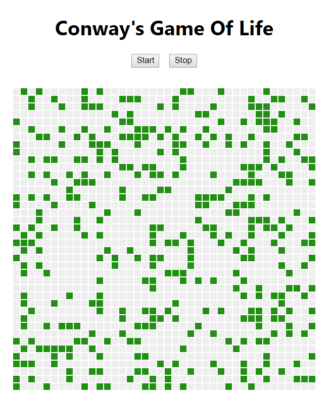
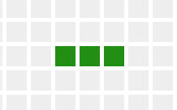
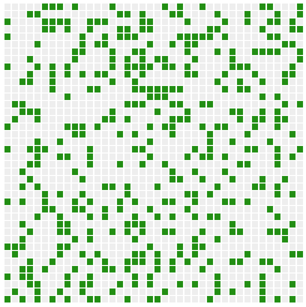

# Module: Solving Problems Together - Conway's Game Of Life

## Background

Conway's Game Of Life is a cellular automaton devised by the British mathematician John Horton Conway in 1970. [(Wikipedia)](https://en.wikipedia.org/wiki/Conway%27s_Game_of_Life)

The Game Of Life is based on a large grid of cells, each of which has an "on" or "off" state. "Life" advances one tick at a time, and cells die, survive, or regenerate based on a simple set of rules. 

For this module, the game board has been built for you. You will implement the rules that determine which cells die, which cells survive, and which cells regenerate, using TDD.

## Pair Up!

Remember when I said this workshop is collaborative? I meant it!

&#128073; Pair up with the person sitting next to you. You're going to work together for this module. 

&#128073; Choose one computer to work from. I recommend determining which of you is more comfortable using the other's text editor, and choosing that computer. 

## Start up The Game

&#128073; Open a new command window from the root of this project, and type `npm run serve-module-4`. This should open a browser window at localhost:8080. The screen will look like this:



This is a randomized starting state for the Game Of Life. We're using a 40x40 grid in this implementation.

Every cell in the grid can be in one of two states: alive or dead. The alive cells show as green, the dead cells are gray.

The game advances one tick at a time. For every tick, each cell will determine its next state based on its 8 neighbors. 

&#128073; Hit the "Start" button. You should see the green cells dance around, as "life" advances. Currently, the cells are configured to randomly replace the previous state. You'll be using TDD to correct this!

&#128073; Hit the "Stop" button. The green cells should stop dancing. You may have to click more than once to make them stop.

There's no actual reason you need to stop the game - the "Stop" button is there in case you get sick of watching the cells dance.

## Ground Rules

### Don't write new code without writing a test first

### Take turns

You'll be taking turns writing tests and making them pass, and working together to refactor along the way. 

### Collaborate to define the test cases

### When you are typing, you decide the code that is written

You may ask for the other’s opinion, but the other may not force you to write the code a certain way.

## Let's Play!

&#128073; Take a look at the `./get-next-state.spec.js` test file. This is where you'll be writing your tests for this exercise.

Currently you'll see one test, named `it('returns a 40x40 grid'...)`. This test verifies that when you call getNextState, it returns a 40x40 grid.

A "grid" is represented as an array of arrays. Each child array is a "row" in the grid; each item in a child array is a "cell" in the grid.

For example, this is a representation of a 3x3 grid, where only the middle cell is active:

```
[
  [0,0,0], // Row 1
  [0,1,0], // Row 2
  [0,0,0], // Row 3
]
```

&#128073; Take a look at the `./get-next-state.js` file. This is where you'll be implementing the specifications for this exercise.

Currently you'll see that `getNextState` is returning 40 dummy rows. Each dummy row returns 40 randomized cells. This is why, when you clicked "Start" in the app, you saw the cells shifting randomly. 

When the app is running, it will repeatedly pass the current 40x40 state to `getNextState`, and render the state returned. Your goal is to update `getNextState` so that it returns the correct 40x40 state.

&#128073; Start up the test suite. 

From a command line at the root of this workshop project, type `npm run test-module-4`. This will start up the test suite. 

At this point, no tests should run, and you should see this message: 

`No tests found related to files changed since last commit.`

&#128073; Start implementing the specifications!

Your collaboration workflow will look like this: 

* Person 1: Write a failing test
* Person 2: Make the test pass
* Person 1&2: Refactor together
* Person 2: Write a failing test
* Person 1: Make the test pass
* Person 1&2: Refactor together
* Repeat

## Specifications

#### 0. Begin with a random "seed" or starting sequence. For each "tick" of the game, return the next state based on the current state.

This is already done for you. You just need to implement specs 1-4, in get-next-state.js.

### For a space that is 'alive' (i.e. has a value of 1 in our implementation):

#### 1. Each cell with one or no neighbors dies (becomes a 0), as if by solitude.
  
#### 2. Each cell with four or more neighbors dies (becomes a 0), as if by overpopulation.

#### 3. Each cell with two or three neighbors survives (remains a 1).

### For a space that is 'dead' or 'empty' (i.e. has a value of 0):

#### 4. Each cell with three neighbors becomes 'alive' (becomes a 1).

## Suggestions

This problem is hard! I don't expect you to finish. Even the first spec is difficult. Here are some suggestions that might help you along the way.

### Keep all methods below 5 lines

Extract functions to make your code smaller & easier to understand.

### Do one task at a time

Try not to implement more than one spec at a time!

### You don't have to pass in an entire 40x40 grid in your tests

A test would be most effective passing in a 3x3 grid with neighbors constructed for the middle cell, and making assertions against only that middle cell.

### Don't forget - each cell has up to 8 neighbors, not 4.

Diagonals count!

### Start by writing specs that aren't going to ship.

Instead of only surviving if it has N neighbors, have a cell survive if it has a neighbor to the left...

Then if it has a neighbor to the right...

Then top, then down...

Then if it has more than one neighbor.

None of these specifications are in the final solution, but they will help you build incremental code. They help prevent you having to make a leap to the final working solution, and point you in the right direction.

Eventually, though, you'll want to delete those incremental tests. 

### Delete tests that are no longer helpful

Often we use tests to guide us to a state that is closer to our final state, but not yet complete. You'll find a point where some tests no longer serve you. Don't be afraid to remove them, or to rewrite them to be helpful!

### Make specific assertions 

General assertions are likely to be invalidated by future tests.

For example, comparing the result of a test to an entire grid is likely to become obsolete when we introduce later specs.

Instead, write assertions that validate only the cells that prove your test, like the following.

```
it('dies if it is alive and has less than two neighbors', () => {
  const input = [
    [1,0,0],
    [0,1,0],
    [0,0,0]
  ];

  const result = getNextState(input);

  // This asserts against a specific cell, instead of the entire result grid.
  expect(result[1][1]).toEqual(0);
})
```

### Refactor to make space for a new feature before you write its test

Sometimes the current state of our code isn't ready for us to introduce a new spec. A new spec might be more easily introduced if we first make some changes to our code. When you notice this, refactor your code before writing the next failing test. This allows you to remain in green for longer, instead of fighting your refactor while in a state of red.

### If you support "the blinker", you're probably feature-complete.

"The blinker" is an oscillating pattern. Its makeup is such that it keeps itself "alive," and perpetually in motion. It looks like this: 



A good test for this oscillator would take input

```
[
  [0,1,0],
  [0,1,0],
  [0,1,0]
]
```

and verify the return value is 

```
[
  [0,0,0],
  [1,1,1],
  [0,0,0]
]
```

If your system supports the blinker, you've probably got all of your features implemented properly.

## When are you complete?

When the cells start to cluster, like this:


